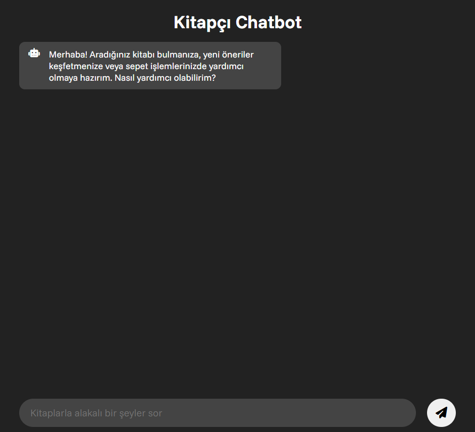
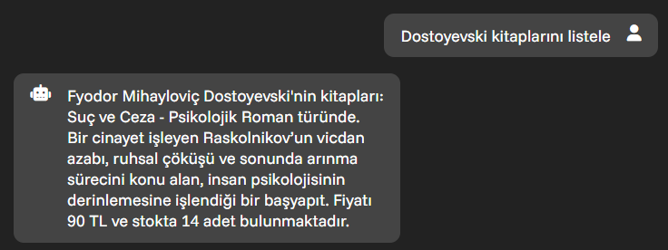
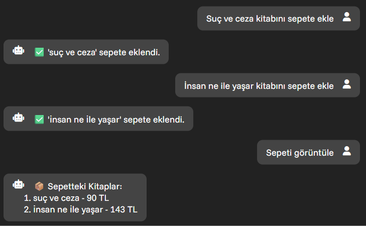
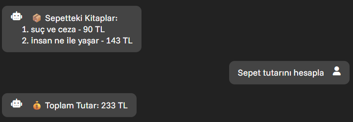
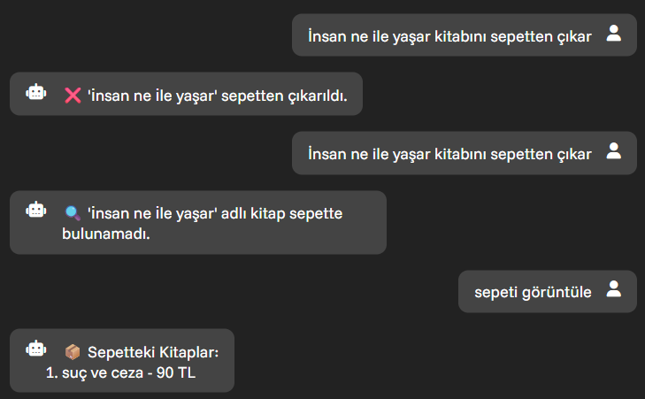
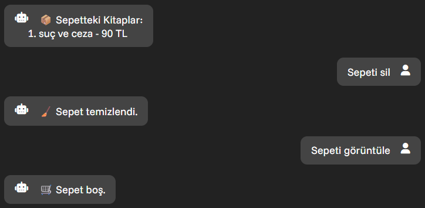

# Chatbot Uygulaması

Bu proje, belirli bir kitap veri kümesi üzerinde çalışan bir sohbet botu (chatbot) API'sidir. Kullanıcıların doğal dildeki sorularına kitap verisi üzerinden anlamlı yanıtlar üretir.

## 🔧 Kurulum

### Gereksinimler

- Python 3.10+
- pip

### 1. Depoyu Klonlayın

```bash
git clone https://github.com/AbdulbakiDEMIR/Chatbot-Proje
```

Repoyu klonladıktan sonra terminalde proje klasörünüze girin:

```bash
cd Chatbot-Proje
```

### 2. Sanal Ortam (İsteğe Bağlı)

```bash
conda create --name chatbot_env
conda activate chatbot_env
```

### 3. Gereksinimleri Kurun

```bash
pip install -r ./requirement.txt
```

### 4. Ortam Değişkenleri

`backend/.env` dosyası içinde gerekli API anahtarları ya da yapılandırmalar yer alır. Örneğin:

```env
OPENAI_API_KEY=sk-xxx...
```

Bu anahtarın çalışabilmesi için bir OpenAI hesabınızın olması gerekir.

## 🚀 Kullanım

### API Sunucusunu Başlatma

```bash
cd backend
python api.py
```

Bu komut `api.py` dosyasındaki FastAPI uygulamasını çalıştırır. Uygulama varsayılan olarak `http://127.0.0.1:1616` adresinde çalışır.

## 📂 Proje Yapısı

```
chatbot_projesi/
├── backend/
│   ├── api.py                 # API sunucusu
│   ├── chatbot_class.py       # Chatbot sınıfı
│   ├── kitaplar_dataset.json  # Veri kümesi (kitaplar)
│   ├── chroma_books_db/       # Vektör veritabanı
│   └── .env                   # Ortam değişkenleri
├── webpage/
│   ├── index.html             # Web sayfası
│   ├── script.js              # JavaScript dosyası
│   └── style.css              # CSS dosyası
├── images/                    # Resim dosyaları
├── requirement.txt            # Python bağımlılıkları
└── readme.md                  # Python bağımlılıkları
```

## 🧠 Kullanılan Teknolojiler

- **Python**
- **FastAPI** – API sunucusu için
- **Chroma DB** – Vektör veritabanı olarak
- **OpenAI API** – Doğal dil işleme ve cevap üretimi

## 📌 Notlar

- `chroma_books_db` klasörü hazır bir veritabanı içerir, ilk çalıştırmada tekrar oluşturulmaz.
- Yeni veriyle çalışmak isterseniz, `chatbot_class.py` içerisinde embedding sürecini gözden geçirmeniz gerekebilir.

# Uygulama

Arayüze ulaşmak için `webpage\index.html` dosyasını herhangi bir tarayıcı üzerinden açın. Karşınıza aşağıdaki gibi bir sayfa gelecek.



**Kitapçı chatbotu kullanarak:**

- Veri setinde var olan yazarın kitaplarını listeleyebilir
- Veri setinde var olan kitapların bilgilerine ulaşabilir
- Veri setinde var olan kitapları sepete ekleme çıkarma işlemlerini yapabilir
- Sepet görüntüleme, sepet tutarı hesaplama, sepetteki tüm kitapları silme işlemlerini yapabilirsiniz.

**Örnek Sorgular**
- Dostoyevski kitaplarını listele
- Kuyucaklı Yusuf kitabı hakında bilgi ver
- Osmancık kitabını sepete ekle
- İnsan ne ile yaşar kitabını sepetten çıkar
- Sepeti görüntüle
- Sepet tutarını hesapla
- Sepeti sil





